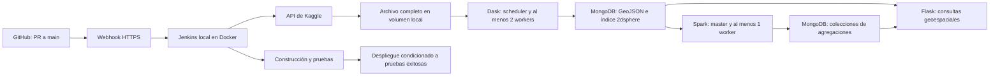

# projectBD — procesamiento geoespacial distribuido

Proyecto académico de procesamiento y consulta de datos geoespaciales.
El enunciado se conserva exclusivamente en el equipo local y se excluye de Git.
Repositorio: https://github.com/Bjonion/projectBD

## Estado

Etapa 1: preparación. Todavía no hay servicios implementados ni comandos de
arranque disponibles. No se ha descargado el dataset ni ejecutado un benchmark.
El plan y los criterios de aceptación están en [docs/plan.md](docs/plan.md).

## Arquitectura prevista

Todos los servicios se definirán en Docker Compose. El entorno objetivo es un
Mac Apple Silicon con 16 GiB de RAM; se deben verificar imágenes compatibles
con ARM64 y ajustar límites de memoria antes de levantar el sistema completo.

## Dataset elegido y validado con el docente

[US Accidents (2016–2023)](https://www.kaggle.com/datasets/sobhanmoosavi/us-accidents),
identificador `sobhanmoosavi/us-accidents`. Kaggle publica el archivo
`US_Accidents_March23.csv` de 3,06 GB, con coordenadas de inicio y fechas.

El usuario confirmó que el docente validó este dataset para el equipo.
La propuesta es automatizar la descarga completa y
procesar una muestra reproducible de al menos un millón de registros válidos.
Se registrarán versión, conteos, reglas de limpieza y método de muestreo.

## Trabajo en Git

- Rama de integración propuesta: `main`.
- Ramas solicitadas: `Andres` y `Julian`, respetando mayúsculas.
- Integrantes: Andres (`agomezp@correo.iue.edu.co`) y Julian (`julilc324@gmail.com`).
- Este Mac corresponde a Andres; su correo se usará en la configuración Git local.
- Cada commit requiere aprobación explícita del usuario sobre cambios revisables.
- Después del primer commit aprobado se crearán las dos ramas desde esa base.
- La integración se realizará mediante pull requests; falta acordar la asignación de tareas.
- Cada contribución debe conservar su autor real. No se simularán aportes del otro integrante.

## Cuentas y credenciales

- GitHub: autenticación local verificada como `Bjonion`, con permisos de escritura
  y administración sobre `projectBD`. Lectura de la API de webhooks verificada.
- Kaggle: metadatos accesibles y descarga comprobada mediante una petición GET
  con token: HTTP 206 y firma ZIP válida, leyendo solo cuatro bytes.
  El endpoint público no permite certificar la identidad del titular del token.
  La credencial proporcionada se conserva en `secrets/kaggle/access_token`,
  excluida de Git, con permisos 600 y directorios con permisos 700.
  Debe rotarse porque fue compartida en el chat. Se configurará en Jenkins y
  se suministrará únicamente al proceso que descarga los datos.
- Jenkins: instancia local en Docker; se creará un administrador durante su instalación.
- Webhook: se propone un túnel temporal de Cloudflare para desarrollo y
  sustentación. No requiere cuenta ni dominio, pero la URL cambia al reiniciarlo.
  La configuración pública se limitará al receptor del webhook; la interfaz
  administrativa se mantendrá local.

La cuenta, el token y las contraseñas se introducen en los servicios o archivos
locales destinados a secretos, no en mensajes del chat ni archivos versionados.

El token suministrado tiene formato de token de acceso actual de Kaggle; se
usará como `KAGGLE_API_TOKEN` durante la descarga o mediante un archivo de token,
en lugar de tratarlo como una clave de autenticación heredada `KAGGLE_KEY`.
No se escribirá en Dockerfiles, Compose, Jenkinsfile, argumentos de shell ni
logs. Flask no recibirá credenciales de Kaggle. Los permisos del archivo local
restringen acceso, pero no cifran su contenido ni constituyen un respaldo externo.
Jenkins usará su almacén de credenciales cuando esté instalado.

## Referencias de preparación

- [API/CLI oficial de Kaggle](https://github.com/Kaggle/kaggle-cli)
- [Jenkins en Docker](https://www.jenkins.io/doc/book/installing/docker/)
- [Cloudflare Quick Tunnels](https://developers.cloudflare.com/tunnel/get-started/quick-tunnels/)
