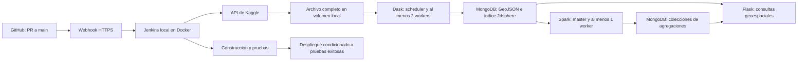

# projectBD — procesamiento geoespacial distribuido

Proyecto académico de procesamiento y consulta de datos geoespaciales.
El enunciado se conserva exclusivamente en el equipo local y se excluye de Git.
Repositorio: https://github.com/Bjonion/projectBD

## Estado

Etapa 1 completada localmente: primer commit y ramas `main`, `Andres` y `Julian`.
Etapa 2 validada: imágenes construidas, ocho contenedores iniciados, workers
conectados, persistencia comprobada y administrador Jenkins configurado.
Infraestructura registrada en el commit aprobado `7ea6319` de la rama Andres.
Etapa 3 completada en el commit aprobado `16185bb` de Andres: descarga completa
e ingesta ejecutadas desde Jenkins. Etapa 4 registrada en el commit aprobado
`05be1c8` de Julian: agregaciones Spark y pruebas con MongoDB real.
Etapa 5 registrada en el commit aprobado `6a9a218` de Julian: consultas Flask,
ocho pruebas aprobadas y comprobaciones HTTP desde Jenkins.
Etapa 6 integrada: commit CI/CD aprobado `f323777`, PR 1 y 2 integrados en main,
pipeline con API candidata y despliegue condicionado. El job de producción
`projectbd` se inició por GitHubPushCause, leyó main y terminó con ocho pruebas
y despliegue exitosos. El job de desarrollo conserva sus evidencias deshabilitado.
Etapa 7 en revisión en Andres: entrada Parquet común y mediciones Dask con dos
y tres workers. Pendiente medición Spark por Julian y comparación final.
El dataset completo ya se descargó y MongoDB
contiene una muestra de un millón de registros. La comparación completa está pendiente.
El plan y los criterios de aceptación están en [docs/plan.md](docs/plan.md).

## Arquitectura prevista



Todos los servicios se definirán en Docker Compose. El entorno objetivo es un
Mac Apple Silicon con 16 GiB de RAM; se deben verificar imágenes compatibles
con ARM64 y ajustar límites de memoria antes de levantar el sistema completo.

## Infraestructura preparada

`docker-compose.yml` define MongoDB, Spark master y worker, Dask scheduler y
dos workers, Flask y Jenkins. Las imágenes base de Python, MongoDB y Jenkins
se fijaron por digest y sus manifiestos ofrecen ARM64 y AMD64. Las dependencias
Python directas se fijaron por versión; las dependencias transitivas, paquetes
APT y plugins Jenkins todavía se resuelven durante la construcción.

Se utiliza MongoDB 7.0 porque el kernel de Docker de este equipo es
`7.0.12-linuxkit`, incompatible con MongoDB 8.x. La matriz oficial documenta
que MongoDB 7.0 es compatible con este rango de kernels:
[SERVER-125742](https://jira.mongodb.org/browse/SERVER-125742).

Spark 3.5.8 usa Java 17 y el conector MongoDB para Scala 2.12, versión 10.7.0.
Se comprobó lectura y escritura con ese conector y ejecución en el worker de
Spark usando colecciones temporales. Jenkins incluye Java 21, Docker CLI, Compose y plugins para GitHub,
Pipeline y credenciales. No se requiere instalar Java o Python nuevos en macOS.

Para construir y levantar el sistema desde la raíz del repositorio:

```sh
docker compose config --quiet
docker compose build
docker compose up -d --wait --wait-timeout 300
docker compose ps
python3 scripts/setup_jenkins.py
```

La construcción, el arranque y el registro de dos workers Dask y un worker
Spark se verificaron en este Mac. El script de configuración Jenkins crea
el administrador local y guarda su contraseña en
`secrets/jenkins/admin_password` con permisos 600, sin imprimirla.
Si el administrador ya existe y coincide con esa contraseña, el script verifica
la autenticación y conserva la configuración. En otro equipo se puede elegir
usuario/correo con `--username` y `--email`.

Resultados de las pruebas: [docs/infraestructura.md](docs/infraestructura.md).

| Servicio | Dirección local | Límite de memoria |
| --- | --- | --- |
| MongoDB | Solo red Docker, `mongodb:27017` | 1 GiB |
| Spark master y driver | http://localhost:8081 | 1 GiB |
| Spark worker | Solo red Docker | 1536 MiB |
| Dask scheduler | http://localhost:8787 | 384 MiB |
| Dask workers | Solo red Docker, dos workers | 768 MiB cada uno |
| Flask | http://localhost:5000/health | 256 MiB |
| Jenkins | http://localhost:8080 | 1536 MiB |

La suma de los límites es 7,125 GiB, dejando margen sobre los aproximadamente
7,75 GiB asignados a Docker. Es un punto de partida; deberá validarse con carga
real. La construcción de imágenes puede requerir memoria adicional.
Los datos y la configuración Jenkins persisten en volúmenes de Docker.

Para detener servicios conservando datos: `docker compose down`.
No usar `docker compose down -v` salvo que se desee borrar los volúmenes.
Jenkins accede al socket Docker para construir y desplegar; el puerto de su
interfaz administrativa se publica solamente en localhost. `DOCKER_GID` permite
ajustar el grupo del socket si el host usa uno distinto del valor inicial 0.

El Jenkinsfile actual cubre descarga e ingesta con pytest. Se ampliará con
Spark, pruebas API y despliegue en la etapa de integración, junto al webhook.
Por ahora, MongoDB no se publica en macOS y no lleva autenticación adicional
en esta red local de desarrollo. La API solo recibe su URI de conexión MongoDB.
El token de Kaggle no se configura como variable persistente de ningún
contenedor ni se monta en los workers, Spark o Flask.

## Descarga e ingesta

La [implementación de ingesta](docs/ingesta.md) explica las reglas de limpieza,
el muestreo y su ejecución desde Jenkins. Se validó el archivo completo de
7.728.394 filas y se publicó una muestra distribuida de 1.000.000 documentos en
`projectbd.accidents`, con puntos GeoJSON e índice `location_2dsphere`.

`ingestion` es un contenedor temporal del perfil `jobs`; utiliza la misma imagen
y volumen que Dask, pero no se levanta como servicio permanente. La credencial
se envía por stdin solo durante la descarga. Con servicios y credencial Jenkins
disponibles, configurar el job con `python3 scripts/setup_ingestion_job.py`.
El modo `--local-source --run` permite probar código todavía no publicado.

## Dataset elegido y validado con el docente

[US Accidents (2016–2023)](https://www.kaggle.com/datasets/sobhanmoosavi/us-accidents),
identificador `sobhanmoosavi/us-accidents`. Kaggle publica el archivo
`US_Accidents_March23.csv` de 3,06 GB, con coordenadas de inicio y fechas.

El usuario confirmó que el docente validó este dataset para el equipo.
La propuesta es automatizar la descarga completa y
procesar una muestra reproducible de al menos un millón de registros válidos.
Se registrarán versión, conteos, reglas de limpieza y método de muestreo.

## Procesamiento Spark

Spark calcula conteos por grilla de 0,01 grados, por hora local y por año/mes,
además de las 20 celdas de mayor concentración. Lee la muestra y escribe las
colecciones de resultados mediante MongoDB Spark Connector. Las reglas,
pruebas y comandos están en [docs/spark.md](docs/spark.md).

## Consultas y API

Flask expone consultas por radio con `$near`, por polígono con `$geoWithin`,
un resumen de distancias con `$geoNear` y los resultados calculados por Spark.
Los parámetros, límites, ejemplos y pruebas se documentan en
[docs/api.md](docs/api.md).

## Trabajo en Git

- Rama de integración propuesta: `main`.
- Ramas solicitadas: `Andres` y `Julian`, respetando mayúsculas.
- Integrantes: Andres (`agomezp@correo.iue.edu.co`) y Julian (`julilc324@gmail.com`).
- Este Mac corresponde a Andres; su correo se usará en la configuración Git local.
- Cada commit requiere aprobación explícita del usuario sobre cambios revisables.
- Ambas ramas comparten la base de ingesta aprobada; Spark y API se desarrollan en `Julian`.
- Cuenta GitHub de Julian confirmada: `Julianlc324`; su autoría usa `julilc324@gmail.com`.
- Commits aprobados publicados en GitHub. [PR de Andres](https://github.com/Bjonion/projectBD/pull/1)
  y [PR de Julian](https://github.com/Bjonion/projectBD/pull/2) integrados conservando
  los originales. Hay tres commits de implementación por integrante;
  GitHub reconoce las cuentas Bjonion y Julianlc324 mediante sus correos.
- La integración se realizará mediante pull requests. Julian revisará y trabajará
  en este Mac; se confirmará la autoría antes de cada commit.
- Cada contribución debe conservar su autor real. No se simularán aportes del otro integrante.
- Ambos integrantes deben participar en infraestructura y código. La distribución
  propuesta y las condiciones de autoría están en [docs/plan.md](docs/plan.md).

## Cuentas y credenciales

- GitHub: autenticación local verificada como `Bjonion`, con permisos de escritura
  y administración sobre `projectBD`. Lectura de la API de webhooks verificada.
- Kaggle: metadatos accesibles y descarga comprobada mediante una petición GET
  con token: HTTP 206 y firma ZIP válida, leyendo solo cuatro bytes.
  El endpoint público no permite certificar la identidad del titular del token.
  La credencial proporcionada se conserva en `secrets/kaggle/access_token`,
  excluida de Git, con permisos 600 y directorios con permisos 700.
  El usuario indicó conservar el token actual durante el desarrollo y cambiarlo
  al finalizar, salvo que deje de funcionar. Ya se guardó como credencial
  cifrada Secret text de Jenkins, con identificador `kaggle-api-token`.
  El pipeline la suministrará únicamente al proceso que descarga los datos.
- Jenkins: instancia local en Docker, administrador `Andres` configurado.
  Su contraseña local está excluida de Git y no se incluye en las imágenes.
- Webhook: se utiliza un túnel temporal de Cloudflare para desarrollo y
  sustentación, autorizado y probado. No requiere cuenta ni dominio; la URL
  cambia al reiniciarlo. `python3 scripts/manage_webhook.py start` inicia el
  túnel y actualiza GitHub; `restart` lo recrea, `status` muestra las URLs y
  `stop` cierra el acceso externo. Solo se publica el receptor firmado.
  Configuración y evidencias en [docs/cicd.md](docs/cicd.md).

La cuenta, el token y las contraseñas se introducen en los servicios o archivos
locales destinados a secretos, no en mensajes del chat ni archivos versionados.

El token suministrado tiene formato de token de acceso actual de Kaggle; se
usará como `KAGGLE_API_TOKEN` durante la descarga o mediante un archivo de token,
en lugar de tratarlo como una clave de autenticación heredada `KAGGLE_KEY`.
No se escribirá en Dockerfiles, Compose, Jenkinsfile, argumentos de shell ni
logs. Flask no recibirá credenciales de Kaggle. Los permisos del archivo local
restringen acceso, pero no cifran su contenido ni constituyen un respaldo externo.
Jenkins ya usa su almacén de credenciales para el token de Kaggle. El volumen
`jenkins_home` conserva ese almacén y las claves de Jenkins. Aún no existe un
respaldo externo; las claves deben protegerse junto con cualquier respaldo.
`.dockerignore` excluye los archivos secretos, datos locales y el enunciado del
contexto de construcción. El proceso de descarga leerá la credencial por
archivo o mediante inyección temporal; no quedará como ENV/ARG de una imagen,
variable persistente de Compose ni respuesta de Flask.

En una instalación nueva, después de crear el administrador, entrar a Jenkins
y abrir Manage Jenkins → Credentials → System → Global credentials → Add
Credentials. Elegir **Secret text**, introducir el token local y usar el ID
`kaggle-api-token`. Este paso ya se completó en el Mac actual. La autenticación
GitHub para publicar se configura aparte; ningún token GitHub está montado en
los contenedores.

## Referencias de preparación

- [API/CLI oficial de Kaggle](https://github.com/Kaggle/kaggle-cli)
- [Jenkins en Docker](https://www.jenkins.io/doc/book/installing/docker/)
- [Cloudflare Quick Tunnels](https://developers.cloudflare.com/tunnel/get-started/quick-tunnels/)
