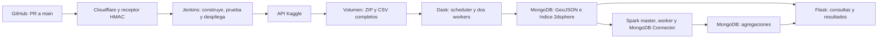

# projectBD: procesamiento geoespacial distribuido

Instituto Universitario de Envigado. Integrantes: **Andrés Gómez Penagos** y
**Julián Londoño Cardona**.

Repositorio: [Bjonion/projectBD](https://github.com/Bjonion/projectBD).

El sistema descarga US Accidents desde Kaggle mediante Jenkins, limpia y carga
un millón de documentos GeoJSON con Dask, calcula agregaciones con Spark y ofrece
consultas geoespaciales en Flask. Incluye Docker Compose, Jenkinsfile, pruebas
con MongoDB real y comparación de ambos motores.

## Dataset y resultados

[US Accidents](https://www.kaggle.com/datasets/sobhanmoosavi/us-accidents),
`sobhanmoosavi/us-accidents`, versión 13. El CSV completo mide 3.058.183.727 bytes
y contiene 7.728.394 registros, superando los requisitos de tamaño y cantidad.
Sus coordenadas permiten consultas espaciales; sus fechas permiten agregaciones
temporales. Jenkins automatiza la descarga completa; Dask procesa una muestra
reproducible de 1.000.000 de filas para ajustarse a la memoria disponible.

MongoDB publica `accidents` con índice `location_2dsphere`. Spark publica
175.583 celdas de grilla, 24 grupos por hora local, 86 grupos por año/mes y las
20 celdas de mayor concentración. Las sumas de grilla, horas y meses conservan
el millón de accidentes. Las cuatro mediciones Dask/Spark produjeron los mismos
conteos sobre los mismos Parquet.

Informe técnico de cuatro páginas: [PDF](output/pdf/informe-tecnico.pdf) y
[fuente Markdown](docs/informe-tecnico.md).

## Arquitectura



## Requisitos

- Docker con Compose, Git y Python 3.9 o superior en el host. Los scripts de
  configuración utilizan solo la biblioteca estándar de Python.
- Docker iniciado, conexión a Internet y puertos locales 5000, 8080, 8081 y
  8787 disponibles. El entorno validado es macOS ARM64 con 16 GiB de RAM y
  aproximadamente 7,75 GiB asignados a Docker.
- Espacio para el CSV de 3,06 GB, ZIP de 685 MB, MongoDB e imágenes; mantener
  varios GB adicionales libres para construcción y trabajos temporales.
- Cuenta Kaggle y token de acceso para la credencial Jenkins. La autenticación
  GitHub por HTTPS debe estar disponible mediante el ayudante de credenciales
  de Git si se va a configurar el webhook. Se necesitan permisos de escritura
  para publicar y de administración de webhooks sobre este repositorio.

Java, Spark, Dask, Flask, MongoDB y Jenkins se ejecutan dentro de contenedores.
No hace falta instalar Java ni las bibliotecas de la aplicación en macOS.
Las imágenes base están fijadas por digest y las dependencias Python directas
por versión; APT, dependencias transitivas y plugins Jenkins se resuelven al
construir. Spark 3.5.8 usa Java 17 y MongoDB Spark Connector 10.7.0 para Scala
2.12. Se usa MongoDB 7.0 por la incompatibilidad observada entre MongoDB 8.x
y el kernel Docker de este equipo.

## Instalación desde cero

### 1. Obtener el código y levantar los servicios

```sh
git clone https://github.com/Bjonion/projectBD.git
cd projectBD
docker compose config --quiet
docker compose build
docker compose up -d --wait --wait-timeout 300
docker compose ps
python3 scripts/setup_jenkins.py
```

El script crea el administrador Jenkins `Andres` y guarda su contraseña en
`secrets/jenkins/admin_password`, con permisos 600 y directorios restringidos.
Abrir ese archivo localmente para consultar la contraseña, sin publicarla ni
copiarla a la documentación. En una reejecución, el script comprueba el
administrador existente y conserva su contraseña.

| Servicio | Acceso desde el host | Memoria del contenedor |
| --- | --- | ---: |
| Flask | http://127.0.0.1:5000/health | 256 MiB |
| Jenkins | http://127.0.0.1:8080 | 1536 MiB |
| Spark master y driver normal | http://127.0.0.1:8081 | 1 GiB |
| Spark worker | Red Docker | 1536 MiB |
| Dask scheduler | http://127.0.0.1:8787 | 384 MiB |
| Dask workers | Red Docker, dos instancias | 768 MiB cada uno |
| MongoDB | Red Docker | 1 GiB |

La API puede mostrar `/health` correcto antes de tener datos; los datos se
publican con la primera ejecución del pipeline. MongoDB no publica un puerto
en el host. Las interfaces y la API se vinculan únicamente a localhost.

### 2. Guardar la credencial Kaggle en Jenkins

Entrar a Jenkins con `Andres` y abrir **Manage Jenkins → Credentials → System →
Global credentials → Add Credentials**. Elegir **Secret text**, introducir el
token de acceso Kaggle y usar el ID exacto **`kaggle-api-token`**.

No introducir la credencial en Dockerfiles, Compose, Jenkinsfile ni argumentos
de shell. Jenkins la guarda cifrada y la envía por stdin solo al contenedor de
descarga. Flask, Spark y los workers no reciben el token. En este Mac también
existe una copia local restringida en `secrets/kaggle/access_token`; esa copia
no es necesaria para ejecutar el pipeline normal en una instalación nueva.

### 3. Configurar y ejecutar el pipeline

```sh
python3 scripts/setup_ingestion_job.py --branch main --run
```

Se crea el job de producción **`projectbd`**, con **Pipeline script from SCM**,
repositorio GitHub y `Jenkinsfile` de main. Revisar su ejecución en Jenkins hasta
que termine con **SUCCESS**. El flujo realiza checkout, construye las imágenes,
levanta servicios, ejecuta ocho pruebas pytest, descarga el dataset completo,
carga la muestra, calcula agregaciones, prueba la API candidata y despliega.
Los reportes quedan archivados en la ejecución Jenkins.

La primera descarga obtiene el ZIP y extrae el CSV completos. Las siguientes
solo reutilizan esos archivos después de verificar versión y hashes. Los datos,
la descarga y la configuración Jenkins persisten en volúmenes Docker.

`projectbd-ingestion` es el job histórico de desarrollo, no un requisito de
instalación. Se deshabilita al configurar producción. El modo opcional
`--local-source --run` permite validar cambios antes de publicarlos; exige la
copia local del token y producción inactiva. Detalles en [CI/CD](docs/cicd.md).

### 4. Configurar el webhook de GitHub

Con Git autenticado por HTTPS y permisos de webhooks:

```sh
python3 scripts/manage_webhook.py start
python3 scripts/manage_webhook.py status
```

El script genera un secreto local, inicia el receptor y un túnel temporal
Cloudflare, detecta su URL, registra o actualiza el webhook y solicita un ping.
En GitHub, **Settings → Webhooks → Recent Deliveries**, comprobar respuesta 200.
No requiere cuenta Cloudflare ni dominio. Solo permite el receptor firmado del
repositorio para eventos de main; la administración Jenkins sigue privada.

Crear cambios en `Andres` o `Julian`, revisarlos mediante PR y hacer merge a
`main`. El evento de GitHub inicia el job `projectbd`. El Mac debe permanecer
encendido, despierto y conectado. Si se recrea el túnel, su dirección cambia:

```sh
python3 scripts/manage_webhook.py restart
python3 scripts/manage_webhook.py status
```

El reinicio actualiza automáticamente la URL en GitHub. La guía personal de
reinicio solicitada por los integrantes se mantiene fuera del repositorio.

## Comprobar datos y API

Después de un pipeline exitoso:

```sh
curl --fail http://127.0.0.1:5000/health
docker compose exec -T api python /app/scripts/smoke_api.py
```

El smoke test busca una ubicación existente, prueba radio, polígono, resumen
y las cuatro colecciones Spark, y comprueba que comparten `run_id`.

| Endpoint | Parámetros y función |
| --- | --- |
| GET /accidents/nearby | latitude, longitude, radius en metros, limit; `$near` |
| POST /accidents/within | polygon GeoJSON y limit en JSON; `$geoWithin` |
| GET /accidents/nearby-summary | latitude, longitude, radius; `$geoNear` y resumen de distancias |
| GET /aggregates/&lt;kind&gt; | grid/hours/months/hotspots, limit y offset; resultados Spark |

Los puntos usan `[longitud, latitud]`. El polígono tiene anillos cerrados.
Parámetros, respuestas y ejemplos curl: [documentación API](docs/api.md).

Las pruebas también se pueden ejecutar por separado con servicios iniciados:

```sh
docker compose run --rm -T --no-deps ingestion python -m pytest -q /app/tests/test_ingestion.py
docker compose exec -T spark-master spark-submit /app/tests/run_spark_tests.py
docker compose exec -T api python -m pytest -q -p no:cacheprovider /app/tests/test_api.py
```

Se usan bases o colecciones temporales y MongoDB real. La validación histórica
introdujo un error solo en una API candidata: pytest falló, Jenkins omitió el
despliegue y conservó la API publicada. Tras retirar el error el pipeline pasó.
La evidencia está en [cicd-result.json](docs/cicd-result.json).

## Reproducir la comparación Dask/Spark

Con la muestra y las agregaciones publicadas y Jenkins sin jobs activos:

```sh
python3 scripts/benchmark_dask.py
python3 scripts/benchmark_spark.py
```

Ejecutarlos en ese orden: Dask exporta la entrada Parquet común y Spark utiliza
los mismos archivos. No ejecutar el pipeline entre ambas mediciones. Cada runner
recrea workers, pausa el otro motor y restaura los servicios normales. Los
workers adicionales pertenecen al perfil `benchmark` y se detienen al terminar.
Los resultados actualizan `docs/benchmark-dask.json` y `docs/benchmark-spark.json`;
una nueva ejecución puede cambiar los tiempos. Actualizar las tablas del informe
solo con los nuevos reportes verificados.

Los benchmarks comparan la misma agregación y sus conteos completos; miden
lectura, cálculo y materialización. La memoria usa máximos reales de cgroup.
Protocolo, tabla y límites de interpretación: [comparación](docs/benchmark.md).

## Detener y volver a iniciar

```sh
python3 scripts/manage_webhook.py stop
docker compose stop
```

Para volver a levantar los servicios y actualizar el túnel:

```sh
docker compose up -d --wait --wait-timeout 300
python3 scripts/manage_webhook.py start
```

Los volúmenes conservan los datos. `docker compose down` también conserva
volúmenes, pero **`docker compose down -v` elimina datos y configuración Jenkins**.
El volumen Jenkins contiene el almacén cifrado y sus claves; su persistencia no
constituye un respaldo externo. El socket Docker concede a Jenkins capacidad
de administrar contenedores de este entorno local.

## Alcance de la verificación de reproducción

Se validaron las configuraciones normal y benchmark en una copia limpia del
código, sin secretos ni archivos locales. En el entorno existente pasaron los
comandos documentados: configuración idempotente Jenkins, tres pruebas de ingesta,
dos Spark, tres API y smoke test HTTP. También se comprobó que los benchmarks
aceptan un job histórico inexistente y bloquean una producción en cola.
No se ejecutó una segunda instalación completa con volúmenes vacíos ni en otro
Mac. Evidencia: [reproduccion-result.json](docs/reproduccion-result.json).

## Trabajo y entregables

`main` es la rama de integración; `Andres` y `Julian` conservan los aportes
individuales y cada commit requiere revisión y aprobación. Los
[PR 1](https://github.com/Bjonion/projectBD/pull/1) y
[PR 2](https://github.com/Bjonion/projectBD/pull/2) conservaron los commits
originales mediante merge. Andres aporta infraestructura MongoDB/Dask, ingesta,
benchmark Dask e informe; Julian aporta Spark, Flask, Jenkins/webhook, benchmark
Spark y documentación de reproducción. Las contribuciones finales todavía
requieren integración a main. La rotación final del token Kaggle está pendiente.
El enunciado y los secretos se excluyen de Git y del contexto de construcción.

- [Informe técnico PDF](output/pdf/informe-tecnico.pdf)
- [Docker Compose](docker-compose.yml) y [Jenkinsfile](Jenkinsfile)
- [Ingesta y limpieza](docs/ingesta.md), [Spark](docs/spark.md), [API](docs/api.md)
- [CI/CD](docs/cicd.md), [comparación](docs/benchmark.md), [plan e historial](docs/plan.md)
