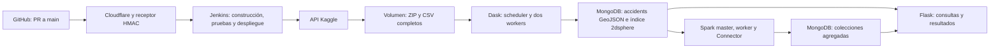

# projectBD: procesamiento geoespacial distribuido

## 1. Propósito y arquitectura

**Instituto Universitario de Envigado.** Integrantes: Andrés Gómez Penagos y Julián Londoño Cardona. Repositorio de GitHub: https://github.com/Bjonion/projectBD.

El sistema descarga US Accidents mediante la API de Kaggle desde Jenkins, limpia y carga una muestra con Dask, procesa agregaciones con Spark y expone consultas geoespaciales mediante Flask. Docker Compose integra MongoDB, Dask scheduler y dos workers, Spark master y un worker, Flask y Jenkins. Los workers adicionales se habilitan únicamente para la comparación.

GitHub envía los eventos de integración a main por un túnel HTTPS temporal de Cloudflare. Un receptor verifica la firma HMAC y permite solamente el evento del repositorio y rama esperados; luego lo entrega a Jenkins. La administración Jenkins sigue en localhost. La URL cambia al recrear el túnel y el script manage_webhook.py actualiza el webhook existente.

La descarga completa, los Parquet del benchmark y sus reportes persisten en dataset; MongoDB y Jenkins tienen volúmenes independientes. Dask y Spark comparten la red Docker backend. MongoDB no publica un puerto en el host. Los puertos de Flask, Jenkins y las interfaces de los motores se vinculan a 127.0.0.1.

El entorno validado es un Mac ARM64 con 16 GiB de RAM y aproximadamente 7,75 GiB asignados a Docker. Los ocho servicios normales suman límites de 7,125 GiB; no se ejecutan los dos benchmarks simultáneamente. Las imágenes base están fijadas por digest, las dependencias Python directas por versión. Paquetes APT, dependencias transitivas y plugins Jenkins aún se resuelven durante la construcción.

MongoDB 7.0 funciona en el kernel Docker de este equipo, donde MongoDB 8.x resultó incompatible. Spark 3.5.8 usa Java 17 y MongoDB Spark Connector 10.7.0 para Scala 2.12. Jenkins utiliza Java 21. No se requiere instalar Java en macOS. El diagrama representa tanto el flujo de datos como la coordinación de la construcción, pruebas y despliegue.

## 2. Datos, limpieza y procesamiento

El dataset escogido es sobhanmoosavi/us-accidents, versión 13, actualizado el 28 de mayo de 2023. Contiene registros de accidentes de tránsito con latitud y longitud de inicio, fecha y hora, ciudad, estado y severidad. Las coordenadas permiten construir puntos GeoJSON y ejecutar consultas por radio y polígono; las fechas permiten calcular agregaciones temporales, y la ubicación permite agrupar por grilla e identificar zonas de concentración. Así aporta los campos necesarios para las funciones del proyecto. El ZIP completo mide 684.855.912 bytes y el CSV US_Accidents_March23.csv mide 3.058.183.727 bytes. Se leyeron 7.728.394 filas: el CSV supera 1 GB y el dataset supera un millón de registros, cumpliendo ambos criterios de volumen de la guía. La descarga completa está automatizada; para limitar los recursos locales se procesa una muestra de 1.000.000 de registros, que cumple el mínimo permitido.

Jenkins suministra la credencial Secret text kaggle-api-token por stdin al proceso de descarga. Se validan el miembro del ZIP, versión y SHA-256 de ZIP y CSV antes de reutilizar una descarga. El CSV completo permanece en el volumen; no se descarga solo la muestra. Su SHA-256 es e3e9f962e3e2289db1bdce91623abbcf9ba4d7bfc1adb091c8aeee6c2639d204.

Dask lee 364 particiones de bloques de 8 MiB. Conserva ID, Start_Time, Start_Lat, Start_Lng, Severity, City, State y Timezone; las otras columnas siguen disponibles en el CSV. Descarta coordenadas nulas/no numéricas, coordenadas fuera de rango, IDs vacíos y fechas inválidas. En esta versión los cuatro conteos de descarte fueron cero; las reglas sí se verificaron con entradas inválidas en pytest. Cero es una coordenada válida y no se descarta por ser cero.

La muestra asigna cuotas proporcionales a las filas válidas de cada partición mediante mayores restos y selecciona los menores hashes deterministas de ID. Así suma exactamente un millón y cubre el archivo completo. No es una estratificación espacial; depende de versión del archivo, tamaño de bloque y versión pandas. No garantiza representación uniforme de ciudades.

Cada documento usa el ID original como _id y location como GeoJSON Point, en orden [longitud, latitud]. Start_Time se conserva en hora local, junto a Timezone, año, mes, fecha y hora; no se etiqueta como UTC. Lotes de hasta 1.000 upserts se escriben en una colección temporal, se verifica un millón de IDs únicos, se crea el índice 2dsphere y se renombra a accidents. Un fallo previo al renombrado conserva la muestra anterior. La reejecución no acumula duplicados.

Spark lee MongoDB mediante el conector, con esquema explícito y hasta ocho particiones por _id. Usa caché DISK_ONLY para limitar memoria y rechaza entradas inválidas. Calcula floor(longitud/0.01), floor(latitud/0.01) y cuenta por celda; floor trata correctamente coordenadas negativas. También agrupa por hora local y año/mes e identifica las veinte celdas con mayor conteo, con desempate determinista.

Resultados publicados: spark_grid tiene 175.583 celdas; spark_hours, 24 grupos; spark_months, 86 grupos; spark_hotspots, 20 celdas. Las sumas de grilla, horas y meses son cada una 1.000.000. Spark escribe con el conector a colecciones temporales y valida antes de publicar. Cada renombrado es atómico, pero los cuatro no forman una transacción conjunta; run_id permite identificar versiones comunes. La grilla es angular, no de área constante, y sus conteos no estiman riesgo vial por población o circulación.

## 3. Consultas, API y despliegue continuo

Flask ejecuta las consultas sobre el índice location_2dsphere. GET /accidents/nearby recibe latitude, longitude, radius y limit; construye $near con $geometry Point y $maxDistance en metros. Devuelve los accidentes de menor a mayor distancia. POST /accidents/within recibe polygon GeoJSON y limit; construye $geoWithin con $geometry y devuelve los documentos interiores, sin prometer orden de distancia.

GET /accidents/nearby-summary coloca $geoNear como primera etapa, con near Point, spherical=true, maxDistance y distanceField. Después $group calcula cantidad, mínimo, máximo y promedio de distancias para todos los documentos del radio. No aplica el límite del listado. GET /aggregates/<kind> ofrece grid, hours, months y hotspots, con limit y offset. GET /health comprueba el acceso real a MongoDB.

Se validan latitud [-90,90], longitud [-180,180], números finitos, radio positivo hasta 20.040.000 metros y límites enteros de 1 a 500. Los anillos del Polygon deben cerrar y tener tres vértices distintos; se admiten huecos. La API construye los operadores y limita las colecciones a una lista permitida. Parámetros inválidos producen 400; cuerpos mayores de 256 KiB, 413; fallos o timeouts MongoDB, 503 sin detalles internos.

El Jenkinsfile cubre checkout, construcción, servicios, pytest, descarga completa, ingesta, agregaciones, pruebas HTTP y despliegue. La API candidata se inicia en api-validation, sin sustituir la API publicada. Solo después de pytest y de las pruebas HTTP se etiqueta y despliega. Se ejecutan tres pruebas de ingesta, dos Spark y tres API, usando MongoDB real y bases/colecciones temporales, además del smoke test HTTP con datos publicados.

Para comprobar que una prueba fallida impide el despliegue, se introdujo intencionalmente un error en una copia temporal de la API candidata, usada por el job de desarrollo. El cambio dividía el radio de búsqueda entre 1.000: una consulta que debía buscar accidentes a 1.000 metros buscaba solo a 1 metro. Las pruebas con pytest detectaron que la consulta no respetaba el radio solicitado. En la ejecución 6, Jenkins marcó el pipeline como fallido y omitió la etapa de despliegue. Se compararon los identificadores del contenedor y de la imagen de la API publicada antes y después de la prueba: ambos permanecieron iguales, confirmando que esa versión no fue sustituida. Después se retiró el error de la copia temporal y se repitió el pipeline; la ejecución 7 aprobó las pruebas y completó el despliegue. El error no se incorporó al código del repositorio. Esta validación demuestra el cumplimiento del requisito de la guía: si una prueba falla, la versión candidata no debe desplegarse.

Los PR 1 y 2 se integraron mediante merge preservando los seis commits originales. Tras separar el historial de desarrollo, el job de producción projectbd build 1 recibió la reentrega del evento real de integración main b47622d, con GitHubPushCause; pasó ocho pruebas y desplegó. La evidencia distingue esta reentrega de un primer disparo inmediato. El job de desarrollo projectbd-ingestion permanece deshabilitado.

La firma válida obtuvo 200, un webhook sin firma 403 y las rutas administrativas públicas 404. Kaggle se guarda cifrado en Jenkins y en un archivo local excluido con permisos restringidos; Flask y los workers no reciben el token. GitHub usa el almacén de credenciales del host. El volumen Jenkins conserva credenciales y claves, pero no existe un respaldo externo. El token actual se mantiene durante el desarrollo por decisión del usuario; su reemplazo al finalizar sigue pendiente. Jenkins tiene acceso al socket Docker; este es un entorno local de desarrollo.

## 4. Comparación Dask/Spark y evidencias

Se exportó la misma muestra, ordenada por _id, a diez Parquet de 100.000 filas con ID, longitud y latitud. Antes de medir, ambos motores verifican los mismos hashes de archivos. La operación común lee coordenadas, calcula la misma grilla de 0,01 grados, cuenta y materializa todas las celdas en el driver. El tiempo excluye exportación, arranque, conexión al clúster, validación de hashes y escritura/verificación posterior de resultados. Se esperan workers o ejecutores conectados antes del cronómetro.

| Motor / workers | Tiempo (s) | Suma de máximos workers (MiB) | Máximo driver (MiB) |
| --- | ---: | ---: | ---: |
| Dask / 2 | 1,011786 | 457,11 | 109,08 |
| Dask / 3 | 0,617470 | 634,65 | 108,73 |
| Spark / 1 | 4,966773 | 415,14 | 454,21 |
| Spark / 2 | 5,230302 | 797,18 | 442,31 |

Cada worker tiene una CPU; Dask utiliza un hilo, límite de proceso de 512 MiB y contenedor de 768 MiB. Spark usa un core de ejecutor, heap de 512 MiB, daemon de 256 MiB y contenedor de 1536 MiB. El driver Spark tiene contenedor de 1 GiB. El heap JVM y el límite Dask no controlan el mismo alcance; se informa la memoria real de cgroup, no se presentan como recursos de memoria idénticos.

La memoria se obtiene de memory.peak de contenedores recreados por configuración, incluyendo procesos, arranque y caché de archivos. Se reportan por separado la suma de máximos de workers y el máximo del driver después de materializar. Se excluyen master/scheduler, MongoDB, Flask y Jenkins. La suma de máximos individuales es una cota superior; no es el máximo simultáneo conjunto.

Las cuatro ejecuciones leyeron un millón de filas en diez particiones y produjeron las mismas 175.583 celdas. Se verificó el SHA-256 de todos los conteos ordenados; además Dask comparó la grilla completa con la colección publicada por Spark. Se confirmaron uno y dos ejecutores Spark activos. Las entradas comparten el hash 69e4e4d7f7cb69e1b591eb74c7d53bc30ba5e9e545f8ba90c2ebbf9f38266b79.

Para esta grilla y este equipo elegiríamos Dask al priorizar latencia y memoria del driver. Tres workers Dask tardaron menos que dos, con mayor suma de máximos de workers. Spark con un worker consumió menos memoria de workers que Dask con dos, pero más en el driver. El segundo worker Spark no mejoró el tiempo y aumentó la memoria. Estas observaciones no prueban una ventaja universal ni permiten extrapolar a datasets mayores. Spark sigue cumpliendo la lectura/escritura MongoDB y el procesamiento distribuido requerido.

Existe una única medición por configuración, en orden Dask 2, Dask 3, Spark 1, Spark 2, sin vaciar cachés. La variabilidad, planificación, compilación de la consulta y coordinación pueden influir en trabajos de pocos segundos. Los 21,857 segundos del reporte histórico Spark incluyen lectura MongoDB, validación y varias agregaciones/escrituras; no se comparan con este benchmark.

Las evidencias versionadas están en docs/ingestion-result.json, docs/spark-result.json, docs/api-result.json, docs/cicd-result.json, docs/benchmark-dask.json y docs/benchmark-spark.json. Los detalles y comandos están en docs/ingesta.md, docs/spark.md, docs/api.md, docs/cicd.md y docs/benchmark.md. Jenkins archiva los reportes de sus ejecuciones.

Andres aporta preparación, infraestructura MongoDB/Dask, ingesta y benchmark Dask; Julian aporta Spark, API, CI/CD y benchmark Spark. Hay cuatro commits aprobados por integrante antes de esta entrega documental. Los últimos benchmarks están publicados en sus ramas y todavía requieren integración a main. El siguiente trabajo consiste en aprobar el informe, completar/verificar el README de instalación limpia en Julian e integrar los cambios conservando su autoría.
